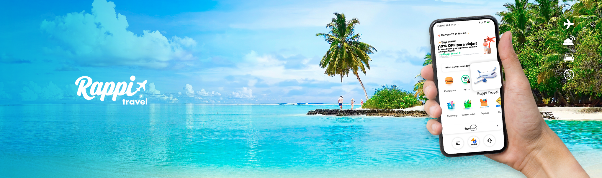

# Rappi CampusLands

Rappi es una plataforma virtual compuesta por una aplicacion para dispositivos moviles y una pagina web por medio de la cual los aliados comerciales exhiben, ofrecen y comercializan productos y/o servicios para que sean adquiridos por los usuarios/consumidores.

### ¿Cómo funciona rappi?
Esta aplicacion tiene varios sevicios y herramientas a dispocision del usuario. Se puede ver los productos y servicios ofrecidos, se puede pagar, ver el estado del pedido, rastrear su ruta de entrega, calificarlos y ponerse en contacto.
Su diseño se encuentra divididos por categorias, al ingresar a cada categoria se observas los aliados comerciales que ofrecen sus productos y servicios.

Algunos de los servicios y herramientas disponibles son:

* Restaurante: Rappi permite a los usuarios pedir comida a restaurantes locales y recibir la entrega en su domicilio. Los usuarios pueden explorar menús, hacer pedidos y pagar a través de la aplicación.

* Supermercado: Rappi ofrece la posibilidad de comprar productos de supermercado, desde alimentos hasta productos de limpieza y más. Los usuarios pueden armar su lista de compras en línea y recibir la entrega en su hogar.

* Farmacia: Rappi permite a los usuarios pedir medicamentos y productos de farmacia a través de la aplicación. Esto es especialmente útil para personas que necesitan recetas médicas o productos de cuidado personal.

* Tiendas: Rappi ofrece la opción de comprar en tiendas físicas y recibir la entrega de los productos en su domicilio. Esto incluye una variedad de tiendas, como tiendas de conveniencia, electrónica, librerías, entre otros.

* Express: Rappi Express es un servicio de mensajería y entrega rápida. Los usuarios pueden enviar documentos, paquetes y otros artículos a través de la plataforma, y los repartidores se encargan de la entrega.

* Licores: Rappi permite a los usuarios pedir bebidas alcohólicas y licores a través de la aplicación, que son entregados de forma segura a su dirección.

* SOAT: En algunos países, Rappi ofrece la posibilidad de adquirir SOAT (Seguro Obligatorio de Accidentes de Tránsito) a través de la aplicación, facilitando el proceso de compra y entrega del seguro.

* Rappi Travel: Este servicio permite a los usuarios buscar y reservar vuelos, hoteles y actividades de viaje a través de la aplicación.

* Mascotas: Rappi ofrece la opción de comprar alimentos, productos y accesorios para mascotas, lo que facilita el cuidado de los animales domésticos.

## Enfoque

Nuesto enfoque principalmente se hará en el servicio que ofrece rappiTravel, ya que este nos ofrece una mejor curva de aprendizaje y es más de nuestro interes.

### Rappi_Travel
Rappi, la súper app de tecnología, anunció el lanzamiento de Rappi Travel, a través de la cual se podrán reservar y descubrir las mejores ofertas en viajes. A partir de hoy, los usuarios encontrarán vuelos a cualquier destino del mundo y, próximamente, esta nueva funcionalidad sumará alojamientos, seguros de viaje, paquetes turísticos, excursiones y alquiler de vehículos.

"En Rappi estamos en la búsqueda constante por ofrecer nuevas soluciones e innovaciones para los millones de usuarios que utilizan nuestra aplicación. A través de Rappi Travel, y de nuestra tecnología, queremos apoyar y brindar incentivos al sector turístico y contribuir a su reactivación para este nuevo año", afirmó Matías Casoy, gerente General para Rappi Cono Sur.

El objetivo principal de Rappi Travel es integrar las mejores ofertas de vuelo, y es parte de la estrategia de la compañía para consolidarse como la súper app de Latinoamérica.

A través de este nuevo botón, los usuarios podrán vivir una experiencia de compra novedosa, sencilla, rápida y totalmente digital. Además, tendrán la posibilidad de crear alertas para ser notificados sobre los mejores vuelos y promociones. 

"Gran parte de nuestros usuarios son viajeros y sabemos que para ellos puede ser muy útil contar con la posibilidad de acceder a ofertas de pasajes aéreos en la misma aplicación donde realizan sus compras de cercanía. Como oferta de lanzamiento, durante todo el mes de enero, los usuarios que realicen una compra en Rappi Travel encontrarán promociones y devoluciones de hasta hasta el 20% en rappicréditos, que podrán ser utilizados para compras en cualquier producto dentro de la app", afirmó Guido Becher, Head Global de Rappi Travel.

## Bibliografia
* [Rappi](https://www.rappi.com.co/)
* [Rappi - Terminos y Condiciones](https://legal.rappi.com.co/colombia/terminos-y-condiciones-de-uso-de-plataforma-rappi-2/)

## AUTORES Y COLABORADORES
- [Jonathan David Alvarez Monsalve](https://github.com/jdam97)    
- [Juan Camilo Paez Ariza](https://github.com/AoKuangg)
- [CampusLands](https://github.com/CampusLands)